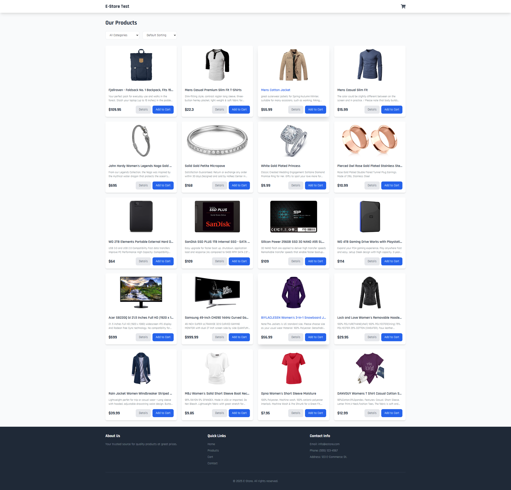
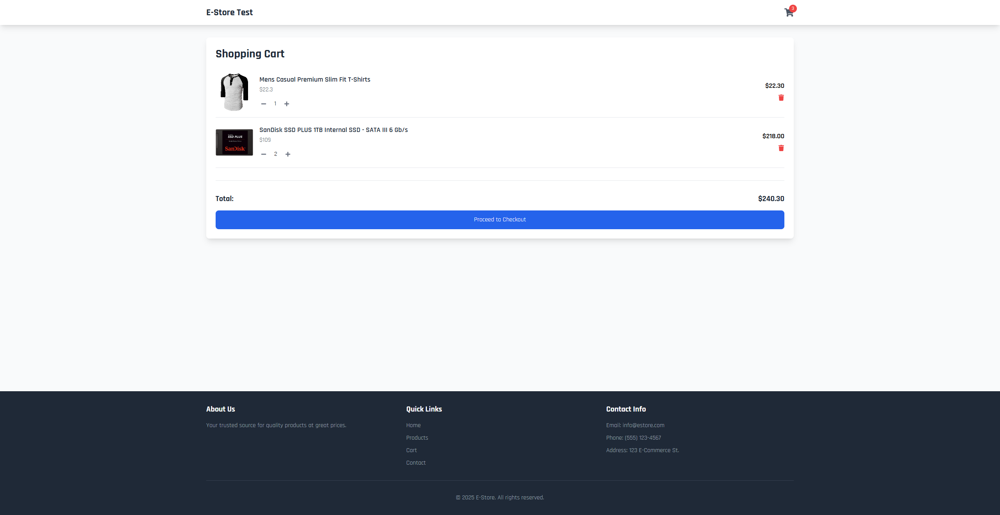
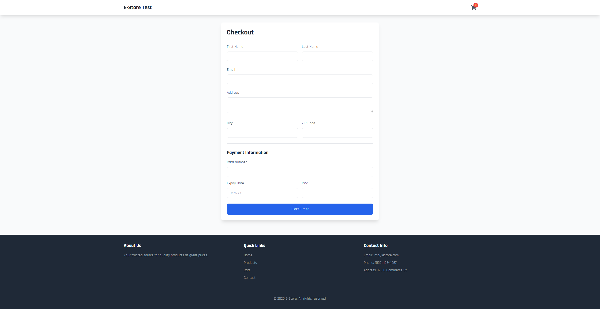

# React E-Commerce Project

E-commerce web application built with React and Tailwind CSS. This project demonstrates fundamental React concepts and modern web development practices.






## Features

- **Product Listing:** Display products with filtering and sorting options
- **Shopping Cart:** Full shopping cart functionality with quantity management
- **Product Details:** Detailed product views with image and description
- **Responsive Design:** Mobile-first approach using **Tailwind CSS**
- **Interactive UI:** Smooth animations and user-friendly alerts
- **API Integration:** Product data fetched from **Fake Store API**

## Technologies Used
- React 18
- React Router v6
- Tailwind CSS
- Context API for state management
- Fake Store API
- React Icons

## Installation

1. Clone the repository:
```bash
git clone https://github.com/mehmetguzel13/react-ecommerce.git
```

2. Navigate to the project directory:
```bash
cd react-ecommerce
```

3. Install dependencies:
```bash
npm install
```

4. Start the development server:
```bash
npm start
```

## Key Components

### ProductList
- Displays all products in a grid layout
- Implements filtering by category
- Provides sorting by price
- Responsive grid system

### ProductCard
- Individual product display
- Quick add to cart functionality
- Interactive hover effects
- Link to product details

### Cart
- Full cart management
- Quantity adjustment
- Total price calculation
- Remove items functionality

### ProductDetail
- Detailed product view
- Add to cart functionality
- Back navigation
- Product image and description

## Configuration

The project uses the following configuration files:

- `tailwind.config.js`: Tailwind CSS configuration
- `postcss.config.js`: PostCSS configuration
- `package.json`: Project dependencies and scripts

## Future Improvements

- [ ] User authentication
- [ ] Wishlist functionality
- [ ] Product reviews and ratings
- [ ] Search functionality
- [ ] Order history
- [ ] Payment integration
- [ ] Admin dashboard

## Responsive Design

The application is fully responsive and works on:
- Desktop (1024px and above)
- Tablet (768px to 1023px)
- Mobile (below 768px)

## License

This project is licensed under the MIT License - see the [LICENSE](LICENSE) file for details.
